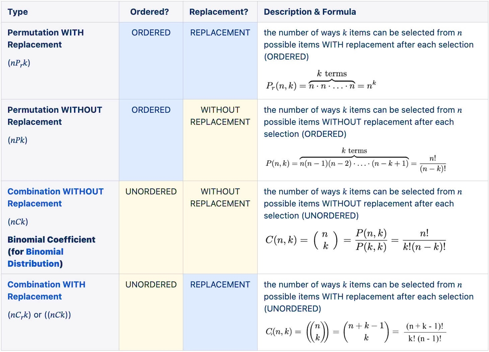
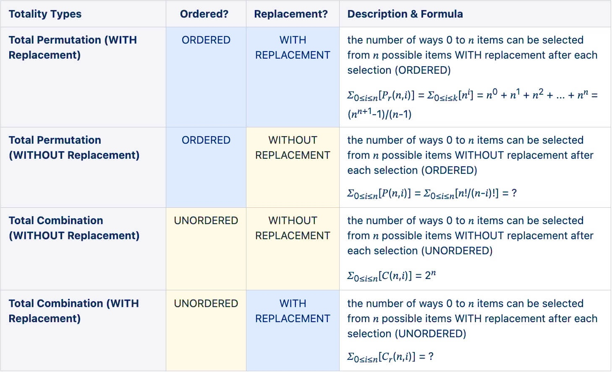

- **permutation** - refers to the different ways of arranging items from a set of objects, in a sequential order 
- **combination** - refers to the different ways of choosing items from a set of objects, such that their order does not matter

# Totality

