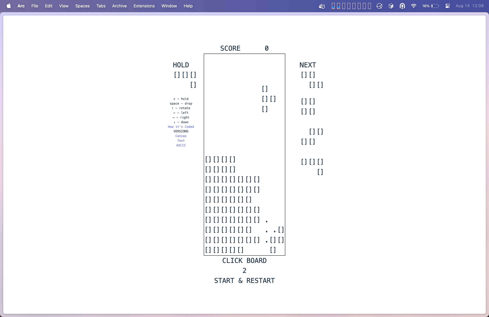

I've first made tetris using [`<canvas>`](/tinkering/2025-08-07/)
then also in [Unicode](/tinkering/2025-08-11/) (i.e. 🟧🟪🟥🟦🟨🟩).

So late at night, I've decided to make tetris again using ASCII characters.

[tetris-ascii.marcuschiu.com](https://tetris-ascii.marcuschiu.com)

